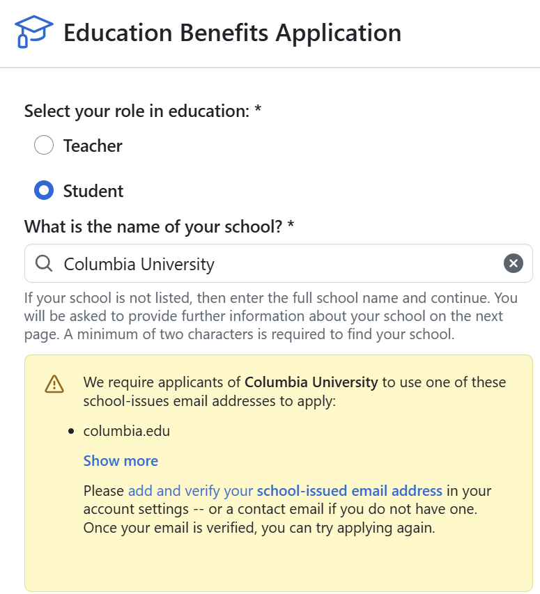

<!-- GENERATED FILE. Do not edit by hand.
     Source: data/tools.yml   Rebuild: python3 scripts/build.py -->

# AI Tools Worth Setting Up Today (with Student Benefit)

The AI tools I actually use, plus a curated secondary list. Every offer on this list was checked against the vendor's own pages on 2026-08-18.

- **Last refreshed:** 2026-08-18
- **Full research notes:** [knowledge-base.md](./knowledge-base.md)
- **Live post:** [twyoon.com/writings/student-ai-tools](https://twyoon.com/writings/student-ai-tools) (unlisted: reachable by link, not indexed or listed)
- **Disclosure:** This guide contains no affiliate or referral links. Every link goes to the vendor's own help-centre or pricing page. Referral programmes are documented as facts about each tool, not as an invitation to use anyone's link.

---

Summer is the best time of year to build, learn and try new tools. It is also the moment to lock in every student-only AI offer you can, especially if you are graduating.

> **If you are a graduating student, move fast.** Most of these offers verify against your .edu email or active student status. The day you lose either, you lose the offer.

There is a bigger pattern at work. AI tools open free or deeply discounted student plans early to drive adoption, then quietly close the door once they have enough traction. Two offers that were on this list have already gone that way:

- **Google Gemini** closed on **2026-03-11**. The free year of Google AI Pro for students ended on 2026-03-11. The student page now reads "Our previous student offer ended on March 11, 2026 and is no longer available in your region."
- **Cursor** closed on **2026-06-25**. Cursor discontinued new sign-ups for the legacy student discount on 2026-06-25. It was a full year of Pro free and it was the strongest offer on this list, so its removal is the single biggest change since the last refresh.

So claim the live ones today, while they are still live.

---

## The five I actually use every day

Tried, used extensively, kept.

### 1. Notion (Free)

The single best note and knowledge tool for grad school. Free Plus plan for a one-member workspace if you have an eligible school email. I run Notion as an operating system for my Product Management coursework and side projects.

- Sign up: https://www.notion.com/help/notion-for-education
- Verification: School email only. The school must be an accredited institution listed in the World Higher Education Database. Notion does not accept student IDs or other documentation.
- Length: Continues while eligibility and school email status remain valid.
- Note: Notion AI is NOT usefully included. As of 2026-08-18 there is no standalone AI add-on to buy. Free and Plus get trial-level AI only, and full AI (Agent, Meeting Notes, Enterprise Search) requires the Business tier at 20 USD per member per month. Custom Agents are metered separately.
- Note: Requires a single-member workspace.

### 2. Figma (Free for 1 year)

Full Professional plan for verified higher-ed students. Slide alternatives, mockups, quick visuals, case-comp decks. Still the default design tool for product designers and PMs.

- Sign up: https://help.figma.com/hc/en-us/articles/360041061214-Figma-for-Education
- Verification: School-issued email, then the education application page with "Higher Ed" selected as institution type. Figma verifies all applications through SheerID.
- Length: One year, then reapply.
- Note: Must reapply annually, it does not auto-renew as free.

### 3. Granola (Free for 12 months)

AI notepad for meetings and lectures. Listens in the background without a bot joining the call, then generates clean structured notes afterwards. I use it for internal team meetings.

- Sign up: https://www.granola.ai/students
- Verification: Student application flow on the Granola student page.
- Length: 12 months.
- Eligibility: Currently enrolled students at accredited universities in the US, UK and Canada.
- Note: The page labels this a LIMITED EDITION promotion, so it may be withdrawn without notice.

### 4. GitHub Student Developer Pack (Free)

The gold-standard student bundle. Copilot, DigitalOcean credits, a Namecheap domain, JetBrains and roughly 30 other developer tools, all unlocked once you verify.

- Sign up: https://education.github.com/pack/
- Verification: GitHub Education benefits application.
- Length: Re-evaluated by GitHub while student status remains valid.
- Note: Add and verify your school-issued email under Settings then Emails before applying. This is the one-time blocker most students hit.
- Note: The temporary pause on new student sign-ups that GitHub documented in early 2026 is no longer present in the docs as of 2026-08-18.
- Note: Copilot access inside the Pack was restructured in March 2026 into a standalone plan called GitHub Copilot Student. It is still free for verified students. GitHub's changelog says the model lineup changed but does not itemise it, so treat any specific model list you read elsewhere as unverified.
- Note: The Pack gains and loses partners quietly. Two AI-relevant additions worth knowing about are Camber (research compute) and SlideCoach (AI presentation coaching, 2,000 credits for verified students).

*The verification step that blocks most applications. Add the school email first, under Settings then Emails.*

### 5. Zed (Free for 1 year)

AI-native editor, and the most credible remaining free route to a premium AI IDE now that Cursor's student discount has closed. Fast, lightweight, and the offer includes real model credits rather than a trial.

- Sign up: https://zed.dev/education
- Verification: Enrolled at an accredited university, at least 18 years old, a GitHub account older than 30 days, and a valid current university email. Enrolment is checked against JetBrains' open-source database of university domains.
- Length: 12 months.
- Eligibility: International students accepted.

---

## Worth knowing about

Strong offers, just not in my daily stack.

### Perplexity ($10/month, 50% off)

The best AI search tool for academic work. Citations, Learn Mode, full Pro model access. If your coursework is research-heavy this is probably the biggest single win on the list.

- Sign up: https://www.perplexity.ai/help-center/en/articles/12590157-what-is-education-pro
- Verification: SheerID, student or faculty at a university-level institution.
- Length: Recurring monthly while verified and subscribed.

### Adobe Creative Cloud (~71% off first year)

The full app suite plus Firefly generative AI in Photoshop, Illustrator and Premiere. The discount is steep in year one and much less so afterwards, so set a renewal reminder the day you sign up.

- Sign up: https://www.adobe.com/creativecloud/buy/students/explore/ccforstudents.html
- Verification: Student verification in the Adobe checkout flow, school email or documents.
- Length: Promotional pricing for the first year, then a materially higher renewal rate.
- Eligibility: Pricing shown is the US market. Other markets differ.
- Note: The year-two price increase is the main trap. Diarise the renewal date.
- Note: Adobe blocks automated checks, so prices here were confirmed against the Adobe education store and secondary sources rather than a direct fetch. Verify the exact figure at checkout.

### OpenAI Codex ($100 in Codex credits)

100 USD of ChatGPT credits earmarked for Codex. Worth being precise about what this is: it is not a ChatGPT Plus discount, and it is not API credit.

- Sign up: https://developers.openai.com/community/students
- Verification: SheerID-style verification with a university email through the claim page.
- Length: Credits expire 12 months after the grant date. Unused credits are lost.
- Eligibility: Degree-granting universities in the US or Canada, and you must be residing in the US or Canada when you claim. One offer per student.
- Note: Requires an existing ChatGPT Free, Go, Plus or Pro account.
- Note: Announced 2026-03-21 with no published end date. Still live as of 2026-08-18.
- Note: This is the route to Codex CLI for students. There is no separate CLI offer. The credits are spent through whichever Codex surface you use, including the CLI and IDE extensions.

### Microsoft 365 Personal ($4.99/month, 50% off)

Half price on the full Office suite with Copilot built into Word, Excel, PowerPoint, OneNote and Outlook, plus 1 TB of OneDrive. The broadest single offer on this list, and the one most students will get the most hours out of.

- Sign up: https://www.microsoft.com/en-us/microsoft-365/college-student-pricing
- Verification: School email, enrolment details, International Student Identity Card, or documentation such as a dated student ID, current progress report, dated class schedule or acceptance letter.
- Length: Ongoing while verified. Microsoft re-checks eligibility annually and will prompt you to re-verify.
- Eligibility: Enrolled full-time or part-time students at accredited universities and colleges.
- Note: You add payment details before verification completes, so set a reminder rather than assuming the re-verification prompt will reach you.
- Note: This is the consumer Personal plan. It is separate from any Microsoft 365 Education licence your school may already give you, which is worth checking first.

### Grammarly (50% off, seasonal)

Writing assistant. The discount runs as a seasonal SheerID campaign rather than a standing offer.

- Sign up: https://shop.sheerid.com/brands/grammarly/
- Verification: SheerID.
- Length: Campaign-based and seasonal. Not always available.
- Note: This is a campaign, not a standing offer. Check whether it is live before relying on it.

### Otter.ai (20% off Pro)

Transcription for lectures, interviews and group meetings. Individual Pro only, not workspace or team plans.

- Sign up: https://help.otter.ai/hc/en-us/articles/4402467517847-Student-Teacher-discount-program-for-the-Pro-plan
- Verification: Otter account with a .edu email through the student discount flow.
- Length: Ongoing while discount eligibility is met.
- Eligibility: Verify at checkout, availability is not clearly global.
- Note: Applies to the individual Pro plan only, not workspace or team plans.

### QuillBot (Up to 25% off)

Paraphrasing and grammar tool with heavy student usage.

- Sign up: https://quillbot.com/upgrade/studentbeans
- Verification: Student Beans or UNiDAYS.
- Length: Campaign-based.
- Note: The student discount does not stack with other promo codes at checkout.

### Beautiful.ai (Free Pro for 12 months)

AI slide-deck builder that does the layout work for you. A free year of Pro is a strong fit for case competitions and pitch decks, where the bottleneck is usually formatting rather than content.

- Sign up: https://support.beautiful.ai/hc/en-us/articles/360030719052-Does-Beautiful-ai-offer-discounts-for-education-or-non-profits
- Verification: Verify a .edu email address and Beautiful.ai emails back a custom coupon code. No promo code hunting required.
- Length: 12 months from activation, then it reverts to the free plan unless you renew.
- Eligibility: Built around .edu addresses. International students without one are told to contact support about alternative verification.
- Note: New student subscribers only. It does not apply to an existing paid account.

### Obsidian (40% off Sync and Publish)

The app itself is free and always has been. This discounts the two paid add-ons, which is what you actually pay for once your vault outgrows one device. A good counterweight to Notion if you want local files you own.

- Sign up: https://obsidian.md/help/discounts
- Verification: Apply from your Obsidian account dashboard using an educational email. Support may accept a student ID or transcript if your institution does not issue one.
- Length: Ongoing while eligible.
- Eligibility: Students and faculty at educational organisations. Non-profit employees also qualify.
- Note: Only the paid add-ons are discounted. If you use Obsidian on one machine you are already paying nothing.

### Loom (Up to 50% off, 75% for classroom use)

Screen recording with AI summaries and transcripts. Genuinely useful for group projects where scheduling a call costs more than recording a four-minute walkthrough.

- Sign up: https://support.atlassian.com/loom/docs/loom-education-discount-verification/
- Verification: Create the Loom account with your institutional email, then submit the Atlassian classroom licence request. Applications are reviewed by Goodstack and take a few business days.
- Length: Ongoing while verified.
- Eligibility: Students, teachers and professors at accredited primary, secondary or tertiary institutions. Minimum age 16.
- Note: The legacy free education plan is gone and is not available to new applicants. This is a discount, not free access.
- Note: Loom is now an Atlassian product, so verification runs through Atlassian rather than loom.com.

### Amp (50% off, $10/month)

Sourcegraph's coding agent, half price for students and teachers with no document check. Treat this as provisional. It was announced the same day this entry was written and has no track record yet.

- Sign up: https://ampcode.com/edu
- Verification: Self-declaration. Sign in and complete a form declaring student or teacher status. No SheerID, no .edu requirement, no document upload.
- Length: Ongoing while enrolled. If you already subscribe, the discount applies at your next renewal with no retroactive refund.
- Eligibility: No geographic restriction stated.
- Note: Applies to the Megawatt tier only, not Gigawatt or other plans.
- Note: Announced 2026-08-18, the same day it was first recorded here. Unproven. Re-check before relying on it.
- Note: Amp states it can change or discontinue the discount and its criteria at any time.

### The rest

- **Consensus** (40% off Premium). Citation-grounded academic search. Strong fit for research-heavy programmes. https://help.consensus.app/en/articles/10064359-how-to-get-a-student-or-clinician-discount
- **Framer** (Free Basic plan, worth $120/year). Design-to-web tool with a free student plan that includes monthly AI credits. The obvious use is hosting a portfolio or personal site without paying for a year. https://www.framer.com/education/
- **Reclaim.ai** (50% off for 12 months). AI calendar that defends time for tasks and habits against meeting creep. Low eligibility bar and a real discount, though you have to actually live in your calendar for it to pay off. https://reclaim.ai/pricing/education-discount
- **Speechify** (25% off Premium). Text to speech for getting through case studies and papers while doing something else. A modest discount, but the use case is a real one during heavy reading terms. https://www.myunidays.com/US/en-US/partners/speechify/view

### Cloud credits

- **Microsoft Azure for Students** ($100 credit, no card needed). 100 USD of Azure credit to use within 12 months, with no credit card required. https://azure.microsoft.com/en-us/free/students/
- **Google Cloud for Students** (200 Google Skills credits). 200 Google Skills credits for hands-on labs, skill badges and courses on Google Cloud Skills Boost. This is learning credit, not deployment credit. https://cloud.google.com/edu/students
- **AWS Educate** (Free self-paced labs). Free self-paced cloud training and hands-on labs covering S3, EC2, VPC, RDS and cloud operations, with digital badges. https://aws.amazon.com/education/awseducate/

---

## Recently closed (kept here on purpose)

Offers are removed from the live list but not deleted from the record. Knowing an offer is gone is as useful as knowing one exists.

### Coda (now Superhuman Docs) (closed 2026-06-30)

The student, teacher and non-profit discount is paused for new applications as of 2026-06-30, following Coda's rebrand to Superhuman Docs.

- Source: https://coda.io/solutions/role/students

### Cursor (closed 2026-06-25)

Cursor discontinued new sign-ups for the legacy student discount on 2026-06-25. It was a full year of Pro free and it was the strongest offer on this list, so its removal is the single biggest change since the last refresh.

- Replacement routes, per Cursor's own docs. Undergraduates can claim credits and discounts at on-campus and online events starting this autumn. Graduate students, researchers and educators can request credits through a form.
- Existing subscribers: If you already redeemed it you keep your current rate until the plan expires, after which it reverts to the standard 20 USD per month Pro rate.
- Source: https://cursor.com/help/account-and-billing/student-discount

### Google Gemini (closed 2026-03-11)

The free year of Google AI Pro for students ended on 2026-03-11. The student page now reads "Our previous student offer ended on March 11, 2026 and is no longer available in your region."

- Source: https://gemini.google/students/

### Tabnine (closed 2025-04-01)

Tabnine ended its free Basic plan in April 2025 and no longer offers a student plan. Recorded so the question stays answered.

- The current pricing page shows no free tier, no trial and no student pricing.
- Existing subscribers: n/a
- Source: https://www.tabnine.com/pricing/

---

## What is *not* on this list (and why)

- **Claude (Anthropic)**. No individual student discount on consumer pricing. Anthropic does not issue one-off discounts or coupons for Pro. The old self-serve Student Builder path (a form, a school email, roughly 50 USD in API credit) is gone from Anthropic's site. It has been folded into the Claude Campus Program, which runs two application-gated tracks: Campus Ambassadors and Claude Builder Clubs. Both grant Claude Pro access plus unspecified API credits and a stipend, but neither publishes a dollar figure, and applications for the current cohort are CLOSED as of 2026-08-18. The External Researcher Access Program (around 1,000 USD in credit) remains a separate route. Outside those, the cheapest official option is Pro on annual billing at 17 USD per month, billed 200 USD up front, against 20 USD billed monthly. Ask your IT or procurement team whether your campus holds a Claude for Education agreement. If it does, signing in to claude.ai with your school email provisions the account at no cost to you.
- **Microsoft Copilot (Microsoft 365 Education)**. Microsoft 365 Copilot Chat costs nothing extra when you sign in with a school account, but only if your institution holds an eligible Microsoft 365 Education licence (A1, A3 or A5) and an admin has switched it on. Neither is something you can claim yourself. Microsoft confirmed in May 2025 that students aged 13 and over can use Copilot Chat once the school enables it. Note the scope: Education A1 does not include the consumer Copilot embedded in Word, Excel and PowerPoint, only the more limited Copilot Chat. Ask your school IT team whether the tenant holds an A1, A3 or A5 licence and whether Copilot Chat is enabled for student accounts.
- **Canva**. Canva for Education is the eligibility-based K-12 offer. Higher-education access runs through Canva Campus, which the institution buys and manages. There is no individual higher-ed claim, so without a Campus licence a university student is on Canva Free. One adjacent route exists. Canva opened Campus Canvassadors, a student ambassador programme for US university students, with its first cohort running August to December 2026. Applications are prioritised for students already at Canva for Campus schools, so it rewards existing access rather than creating it. Ask whether your school has procured Canva Campus.
- **Midjourney**. No individual student programme in 2026. The 20 percent saving on annual billing is available to everyone and is not a student discount. Midjourney's educational-use policy is explicit that each student needs their own account and their own subscription. There are no shared accounts, no group plans and no way for a school to manage student accounts centrally, though schools can reimburse students directly.
- **CapCut Creative Campus**. Restricted to a small set of named partner schools, none of them business or graduate programmes. There is no individual claim path. Check whether your institution is a named Creative Campus partner.
- **Gemini CLI**. No student offer, and none is needed. Signing in with any personal Google account gives 1,000 model requests per day and 60 per minute at no cost, with no trial expiry. A student would gain nothing from a discount here. Flash is the default on the free tier, so the 1,000 daily requests are not 1,000 Pro requests. Authenticating with an unpaid API key instead of a Google account is materially worse: 250 requests per day, 10 per minute, Flash only. Sign in with the account, not the key. Nothing to claim. Install it and sign in.
- **NotebookLM**. No student-specific offer. The core product is free to everyone with a Google account, and the free Gemini tier includes NotebookLM access. Higher-education students aged 18 and over can create personal class notebooks inside Google Classroom, grounded in materials their educator provides, but that is an institutional integration rather than a claimable discount. The paid tier rides on Google AI Pro, whose student offers have all expired. See the Google Gemini entry. Nothing to claim. Use it free, and check Google Classroom if your course uses it.
- **SciSpace, Julius AI, Humata**. Dropped. Official student terms could not be confirmed after more than three months of trying, so they are excluded rather than listed on a maybe.

---

## How to verify anything here

1. **Click the official link.** These are help-centre and pricing pages, not deal-aggregator sites.
2. **Check the refresh date at the top.** If it is more than 90 days old, re-verify before sharing.
3. **Try SheerID, Student Beans or UNiDAYS directly** if you are hunting beyond this list. Many discounts route through them.

---

## Changelog

- **2026-08-18 (sweep)** Multi-agent sweep across six discovery angles. 29 candidates, 26 confirmed against vendor pages, 8 added to the public list.
- **2026-08-18 (sweep)** Added Microsoft 365 Personal (50 percent off at 4.99 USD per month with Copilot included), the strongest find of the sweep.
- **2026-08-18 (sweep)** Added Beautiful.ai, Obsidian, Loom, Amp, Framer, Reclaim.ai and Speechify.
- **2026-08-18 (sweep)** Added Prezi, Wordtune, Craft, Litmaps, Trinka and Sunsama to the knowledge base only. Prezi, Trinka and Sunsama are withheld from the public list because no vendor page discloses the actual discount size.
- **2026-08-18 (sweep)** Notion AI correction: there is no standalone AI add-on any more. Free and Plus get trial-level AI only and full AI now requires the Business tier.
- **2026-08-18 (sweep)** Claude correction: the self-serve Student Builder credit path is gone, folded into the application-gated Campus Program, currently closed.
- **2026-08-18 (sweep)** GitHub: Copilot for students was restructured in March 2026 into a standalone GitHub Copilot Student plan, still free.
- **2026-08-18 (sweep)** Recorded Tabnine as ended, CapCut Creative Campus as institutional, and Coda/Superhuman Docs as paused.
- **2026-08-18 (sweep)** Dropped Manus (refuted: its "student" credit grant is the standard grant every new user gets), ClickUp and Vimeo.
- **2026-08-18 (sweep)** FIXED A DATA BUG: seven entries in ruled_out and referral_tools used unquoted commas inside YAML flow mappings, which silently split their values into phantom keys and truncated the published text. Mem.ai's reason had been inverted to "Invitations are for collaboration", dropping "not rewarded referrals". Both sections converted to block style and a schema check added to CI.
- **2026-08-18** Restructured the repo. data/tools.yml is now the single source of truth; recommended.md and knowledge-base.md are generated from it.
- **2026-08-18** Cursor moved to status ended. New sign-ups for the legacy student discount closed 2026-06-25.
- **2026-08-18** Zed promoted into the daily-use list to fill the AI-editor slot Cursor vacated.
- **2026-08-18** Perplexity: recorded that the 24-month student referral extension ended 2026-05-31.
- **2026-08-18** GitHub Copilot: removed the stale paused-sign-ups caveat, which GitHub docs no longer carry.
- **2026-08-18** Claude entry rewritten around Claude for Education, Student Builder credits and the External Researcher programme.
- **2026-08-18** Fixed dead links: HeyGen and Grammarly referral articles (404), Anthropic pricing redirect, Consensus slug change, OpenAI Codex canonical URL.
- **2026-08-18** HeyGen reclassified from two-sided referral to ruled out.
- **2026-08-18** SciSpace, Julius AI and Humata dropped after three months unresolved.
- **2026-08-18** Removed all unfilled referral-link placeholders and added an explicit no-affiliate-links policy.
- **2026-08-18** Added LICENSE (CC BY 4.0), CONTRIBUTING, .gitignore, and CI for link checking and freshness.
- **2026-07-19** Removed BizCrush from the daily-use list and knowledge base.
- **2026-05-14** Added BizCrush (later removed). Repositioned Granola as the complementary tool for non-BizCrush contexts.
- **2026-05-14** Switched framing to urgency-led, using the Gemini sunset as the motivating example.
- **2026-05-14** Demoted Perplexity, Adobe and Otter to a secondary section.
- **2026-05-14** Initial public-facing version split out from the working research doc. Audited referral programmes for all 16 original tools.
- **2026-05-03** Document created and given its first validation pass against official docs.
- **2026-05-03** Restructured to a decision-criteria format and added the cloud-credits section.

---

*Maintained by Taewan Yoon. Source repo: [github.com/tyoon10/student-ai-tools](https://github.com/tyoon10/student-ai-tools). Spot something out of date? Open an issue.*
